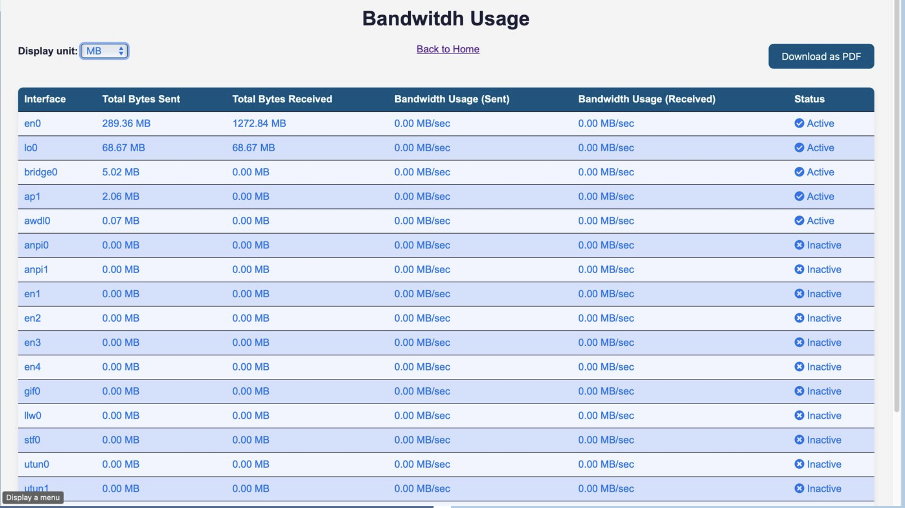
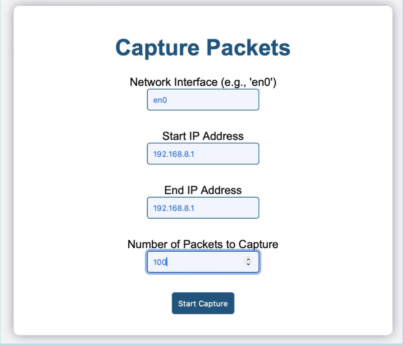
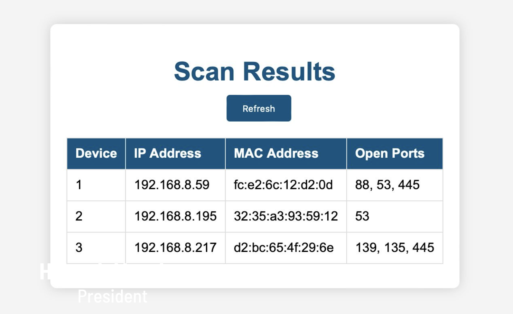

# CAS_Network_Tool

## Overview

This project is designed to monitor and visualize network activities using multiple components. The components include network interface statistics, network topology visualization, packet sniffing, and port scanning. It is built using Flask for the web framework, Scapy for packet manipulation, and Plotly for visualization.

## Table of Contents

- [Network Monitoring Project](#network-monitoring-project)
  - [Overview](#overview)
  - [Table of Contents](#table-of-contents)
  - [Features](#features)
  - [Requirements](#requirements)
  - [Installation](#installation)
  - [Usage](#usage)
    - [Running Flask Apps](#running-flask-apps)
    - [Accessing HTML Server](#accessing-html-server)
    - [Packet Capture](#packet-capture)
    - [Network Topology](#network-topology)
    - [Port Scanning](#port-scanning)
  - [Project Structure](#project-structure)
  - [Contributing](#contributing)
  - [License](#license)
  - [Acknowledgments](#acknowledgments)

## Features

- **Network Statistics**: Monitor and display network interface statistics such as bytes sent and received.
- **Network Topology Visualization**: Create and visualize various network topologies.
- **Packet Sniffing**: Capture and display network packets within a specified IP range.
- **Port Scanning**: Scan and identify open ports on devices within a network.

<<<<<<< HEAD
=======
## 🛠️ Technology Stack

| **Frontend**     | **Backend**   | **Packet Manipulation**  | **Visualization**  | **Libraries**  | **Version Control** |
|------------------|---------------|--------------------------|--------------------|----------------|---------------------|
|  |  |  |  |  |  |
|  |  |                          |                    |  |                     |
|  |               |                          |                    |                |                     |


>>>>>>> 8937900 (Your commit message here)
## Requirements

- Python 3.6+
- Flask
- Plotly
- Scapy
- NetworkX
- Pandas

## Installation

1. **Clone the repository**:
    ```bash
    git clone https://github.com/lokesh-kummari/CAS_Network_Tool
    cd CAS_Network_Tool
    ```

2. **Create and activate a virtual environment** (optional but recommended):
    ```bash
    python3 -m venv venv
    source venv/bin/activate  # On Windows use `venv\Scripts\activate`
    ```

3. **Install required packages**:
    ```bash
    pip install -r requirements.txt
    ```

4. **Install Scapy**:
    ```bash
    pip install scapy
    ```

## Usage

### Running Flask Apps

There are multiple Flask applications to run for different functionalities. Below are the steps to run each app:

1. **Network Interface Statistics**:
    ```bash
    python app.py
    ```
    Access it at [http://127.0.0.1:5001](http://127.0.0.1:5001)

2. **Packet Capture**:
    ```bash
    python app1.py
    ```
    Access it at [http://127.0.0.1:8000](http://127.0.0.1:8000)

3. **Network Topology Visualization**:
    ```bash
    python networktopo.py
    ```
    Access it at [http://127.0.0.1:5002](http://127.0.0.1:5002)

4. **Port Scanning**:
    ```bash
    python portscanner.py
    ```
    Access it at [http://127.0.0.1:5000](http://127.0.0.1:5000)

### Accessing HTML Server

1. **Start HTML server**:
    ```bash
    python start_server.py
    ```
    Access it at [http://127.0.0.1:3000/home.html](http://127.0.0.1:3000/home.html)

### Packet Capture

1. **Enter details** on the Packet Capture webpage to start capturing packets:
    - Network interface (e.g., `en0` or `eth0`)
    - Start IP address of the range
    - End IP address of the range
    - Number of packets to capture

### Network Topology

1. **Access the Network Topology** page to see the current network setup and its graphical representation. Different topologies like bus, star, and ring can be visualized.

### Port Scanning

1. **Enter the IP range** on the Port Scanning webpage to scan for open ports across devices in the specified range.

<<<<<<< HEAD
## Project Structure
.
├── app.py # Network Statistics Flask app
├── app1.py # Packet Capture Flask app
├── networktopo.py # Network Topology Visualization Flask app
├── portscanner.py # Port Scanning Flask app
├── start_server.py # Script to start Flask servers and HTML server
├── requirements.txt # Required Python packages
├── README.md # This README file
├── templates/ # HTML templates for Flask apps
│ ├── index.html # Main HTML page
│ ├── index1.html # Packet Capture HTML page
│ ├── index2.html # Network Statistics HTML page
│ ├── index3.html # Network Topology HTML page
│ └── index4.html # Port Scanning HTML page
└── static/ # Static files (CSS, JS, images)

=======
## Output

Here are some examples of the output generated by the **CAS Network Tool** for different functionalities:

### 1. Network Interface Statistics Output



### 2. Packet Capture Output



### 4. Port Scanning Output

>>>>>>> 8937900 (Your commit message here)
## Contributing

Contributions are welcome! Please follow the steps below to contribute:

1. Fork the repository.
2. Create a new branch (`git checkout -b feature/your-feature-name`).
3. Make your changes.
4. Commit your changes (`git commit -m 'Add some feature'`).
5. Push to the branch (`git push origin feature/your-feature-name`).
6. Open a Pull Request.

For more information, refer to the [Contributing Guidelines](CONTRIBUTING.md).

## License

This project is licensed under the MIT License - see the [LICENSE](LICENSE) file for details.

## Acknowledgments

- Thanks to the developers of [Flask](https://flask.palletsprojects.com/), [Scapy](https://scapy.net/), and [Plotly](https://plotly.com/) for their amazing libraries.
- Special thanks to the open-source community for providing valuable resources and inspiration.

